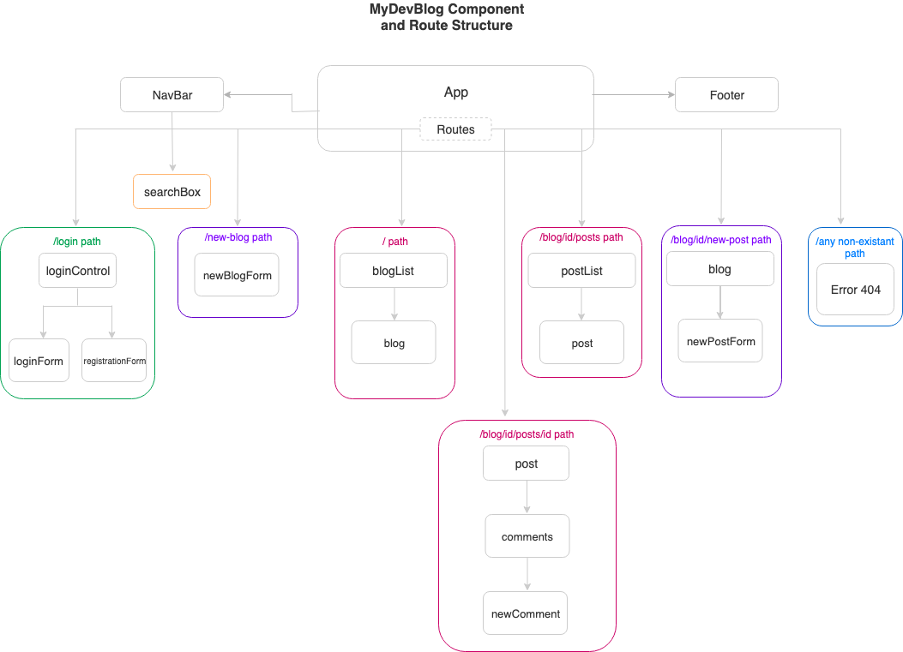

# MyDevBlog

#### MyDevBlog is a blog specifically for junior developers, who has jus started their carrier and wants to show their skills, share their thoughts and have fun.

#### By _**Svitlana Filatova**_

This project was bootstrapped with [Create React App](https://github.com/facebook/create-react-app).

## Description

| User stories                                                                                                                                                                                   |
| ---------------------------------------------------------------------------------------------------------------------------------------------------------------------------------------------- |
| As an unregistered user, I need to be able to register with my username and password. Username and password must be unique. If a username or password is not unique the warning should appear. |
| As an unregistered user I need to be able to see blogs and posts. I'm not allowed to edit or delete someones blogs or posts, or leave comments.                                                |
| As a registered user I need to be able to add a blog.                                                                                                                                          |
| As a registered user I need to be able to edit blog title and description.                                                                                                                     |
| As a registered user I need to be able to add posts to my blog.                                                                                                                                |
| As a registered user I need to be able to add an image to my posts.                                                                                                                            |
| As a registered user I need to be able to edit posts of my blog (title, content).                                                                                                              |
| As a registered user I need to be able to add comments to posts.                                                                                                                               |
| As a registered user I need to be able to "like" posts.                                                                                                                                        |

## App Components Structure

## Setup/Installation Requirements

- _Clone this repository on your Desktop._
- _Open Terminal (for Mac users) or PowerShell (for Windows users), navigate to blog folder(cd .../Desktop/blog) and run the following command: npm i. After installing all packages run npm start._
- _Now run npm start and open a localhost:3000 in your browser._

## Known Bugs / Limitations

- _No bugs found._
- _"Like" component doesn't do pretty much anything yet._

## Support and contact details

_Contact Svitlana Filatova at svitlana.filatova@gmail.com._

## Technologies Used

_React, React-Router, Javascript, Webpack, Babel, CSS, Bootstrap._

### License

_This software (sans images) is licensed under the MIT license._

Copyright (c) 2019 **_Svitlana Filatova_**
